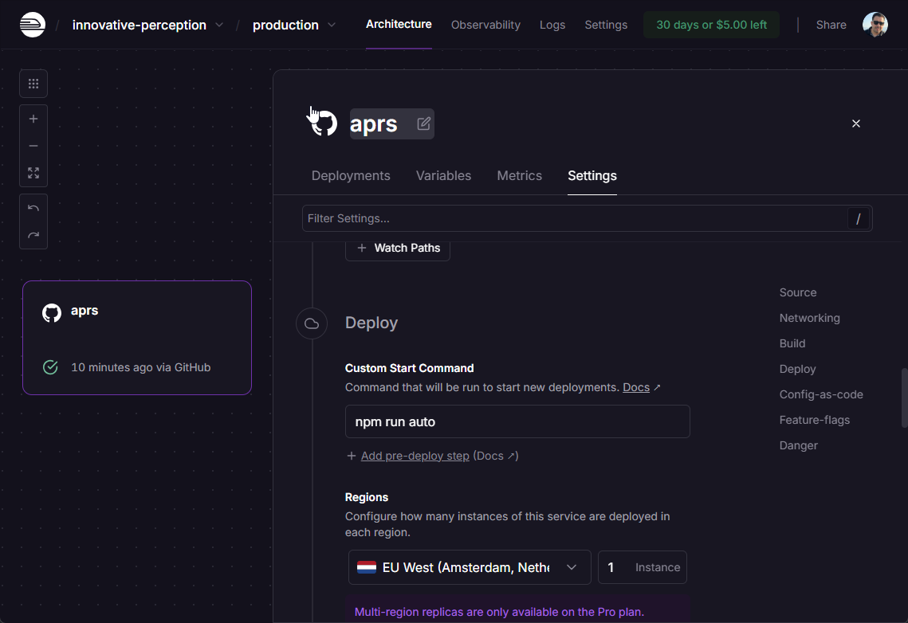
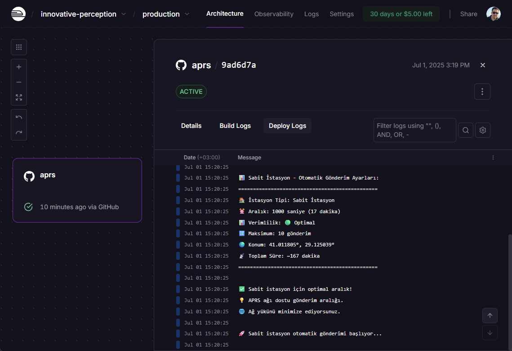

# 📡 APRS Position Sender

Node.js ile APRS-IS üzerinden konum gönderme uygulaması.

## 🚀 Özellikler

- ✅ APRS pozisyon paketi oluşturma
- ✅ APRS-IS üzerinden gerçek gönderim
- ✅ Otomatik periyodik gönderim
- ✅ Simülasyon modu
- ✅ Passcode otomatik hesaplama
- ✅ Rate limiting koruması

<details>
<summary><strong>🚂 Railway Deployment (Tıklayın)</strong></summary>

Bu projeyi Railway üzerinde ücretsiz olarak 7/24 çalıştırabilirsiniz:

### 📱 NPM Run Auto


### 📊 Railway Deployment Logları


### 🚀 Hızlı Kurulum
```bash
# 1. Railway CLI kur
npm install -g @railway/cli

# 2. Login ol
railway login

# 3. Proje başlat
railway init

# 4. Environment variables ekle
railway add CALLSIGN=TB2ABI
railway add LATITUDE=41.011805
railway add LONGITUDE=29.125039
railway add APRS_IS_PASSCODE=22440
railway add AUTO_SEND_ENABLED=true
railway add AUTO_SEND_INTERVAL=600
railway add AUTO_SEND_COUNT=10

# 5. Deploy et
railway up
```

### ✅ Railway Kurulum
- **Ücretsiz**: 750 saat/ay + $5 kredi
- **TCP Socket**: APRS-IS tam destek ✅
- **Always-on**: 7/24 çalışır, uyku modu yok
- **Git entegrasyonu**: Otomatik deployment
- **Environment variables**: Tam destek

### 🔧 Alternatif Deployment Seçenekleri
| Platform | Ücretsiz Plan | TCP Desteği | Always-On | Önerilen |
|----------|---------------|-------------|-----------|----------|
| 🚂 Railway | 750 saat/ay | ✅ | ✅ | ⭐⭐⭐⭐⭐ |
| 🎨 Render | 750 saat/ay | ✅ | ✅ | ⭐⭐⭐⭐ |
| 🟣 Heroku | 1000 saat/ay | ⚠️ | ❌ Sleep | ⭐⭐⭐ |
| 🐋 Fly.io | 3 app limit | ✅ | ✅ | ⭐⭐⭐⭐ |

**5 dakikada Railway'de çalışır durumda!** 🎉

</details>

## 📋 Kurulum

```bash
npm install
```

## ⚙️ Konfigürasyon

`.env` dosyasını düzenleyin:

```properties
# Gerekli ayarlar
CALLSIGN=YourCall-1
LATITUDE=41.01150
LONGITUDE=29.12550
COMMENT=Your message
SYMBOL=/-

# APRS-IS ayarları
APRS_IS_PASSCODE=12345

# Otomatik gönderim (opsiyonel)
AUTO_SEND_ENABLED=false
AUTO_SEND_INTERVAL=300
AUTO_SEND_COUNT=5
```

## 🎯 Kullanım

### Simülasyon (Test)
```bash
npm start
# veya
node index.js
```

### Tek Gönderim
```bash
npm run send
# veya
node index.js --send
```

### Otomatik Gönderim
```bash
npm run auto
# veya
node index.js --auto
```

## 📊 Sabit İstasyon - Gönderim Aralıkları

| 🏠 **İstasyon Tipi** | ⏱️ **Aralık** | ✅ **Önerilen** | 📝 **Açıklama** |
|----------------------|----------------|-----------------|------------------|
| 🚨 **Acil Durum**    | 30 saniye      | 1 dakika        | Kritik durumlar  |
| 🏠 **Ev İstasyonu**  | 10 dakika      | 15-30 dakika    | Sabit konum      |
| 📡 **Repeater**      | 30 dakika      | 60 dakika       | Altyapı          |
| 🧪 **Test/Demo**     | 2 dakika       | 5 dakika        | Geliştirme       |

### 🎯 **Sabit İstasyon Optimizasyonları**

- ✅ **Varsayılan aralık**: 10 dakika (600 saniye)
- ✅ **Optimal aralık**: 15-30 dakika
- ✅ **Maksimum gönderim**: 10 paket
- ✅ **Toplam çalışma süresi**: ~100 dakika
- ✅ **Ağ dostu**: Minimal APRS ağı yükü

### ⚠️ Önemli Notlar

- **Minimum aralık**: 60 saniye (güvenlik limiti)
- **Spam koruması**: Aynı paket tekrarlanmaz
- **Rate limiting**: Çok sık gönderim IP ban'e neden olur
- **Ağ yükü**: APRS ağını gereksiz yüklemeyin

## 🔧 Passcode Hesaplama

Uygulama otomatik olarak callsign'ınız için passcode hesaplar:

```bash
node index.js --send
# Çıktıda passcode gösterilir
```

## 📡 APRS Sembolleri

[`aprs-symbols.html`](aprs-symbols.html) dosyasını tarayıcıda açarak mevcut sembolleri görebilirsiniz.

## 🌐 Kontrol

Gönderilen paketleri şu adreslerde kontrol edebilirsiniz:

- [APRS.fi](https://aprs.fi/)
- [APRSDirect](https://www.aprsdirect.com/)
- [FINDU](http://www.findu.com/)

## 📝 Örnek Çıktı

```
🚀 APRS-IS Gerçek Gönderim Modu

📦 Gönderilecek Paket Bilgileri:
=====================================
📍 İstasyon: TB2ABI
🌍 Konum: 41.0115°, 29.1255°
💬 Yorum: https://mustafagenc.info
🔣 Sembol: /-
📦 Paket: TB2ABI>APRS:=4100.69N/02907.53E-https://mustafagenc.info
=====================================

🔗 APRS-IS sunucusuna bağlanılıyor: euro.aprs2.net:14580
✅ APRS-IS sunucusuna bağlandı
📤 Login paketi gönderildi: user TB2ABI pass 22440 vers NodeAPRS 1.0
📥 Sunucudan gelen: # logresp TB2ABI verified, server T2LAUSITZ
✅ Giriş doğrulandı - gönderim izni var
📡 Paket APRS ağına gönderiliyor...
📡 Paket gönderildi: TB2ABI>APRS:=4100.69N/02907.53E-https://mustafagenc.info
🔌 APRS-IS bağlantısı kapatıldı
✅ Paket başarıyla APRS ağına gönderildi!
```

## 🛡️ Güvenlik

- Passcode'ları güvenli tutun
- `.env` dosyasını Git'e eklemeyin
- Rate limiting kurallarına uyun
- Gereksiz gönderim yapmayın

## 📄 Lisans

Licensed under the Apache License 2.0 - see [LICENSE](LICENSE) file.
